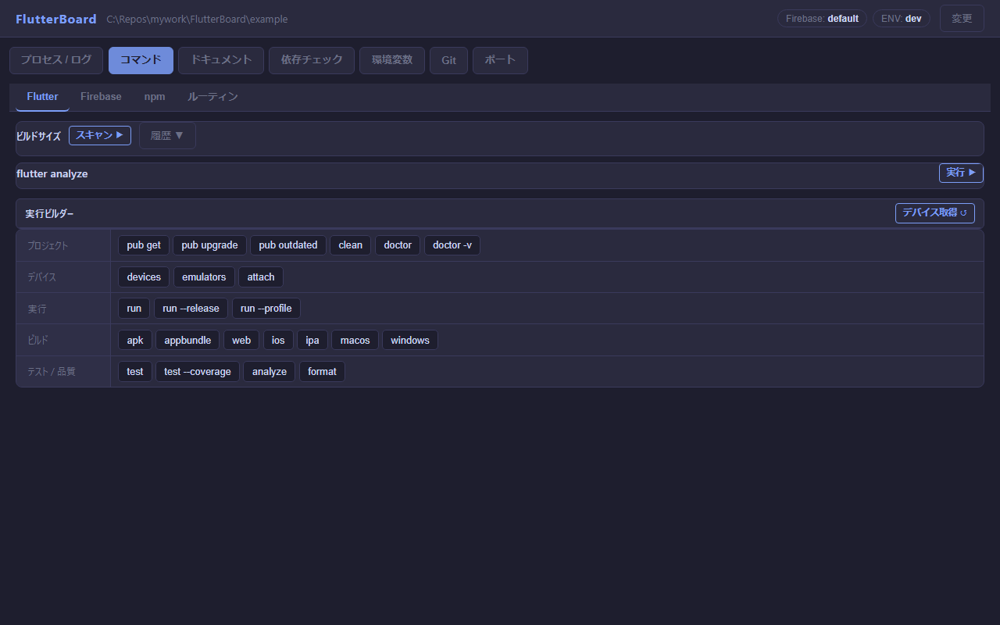
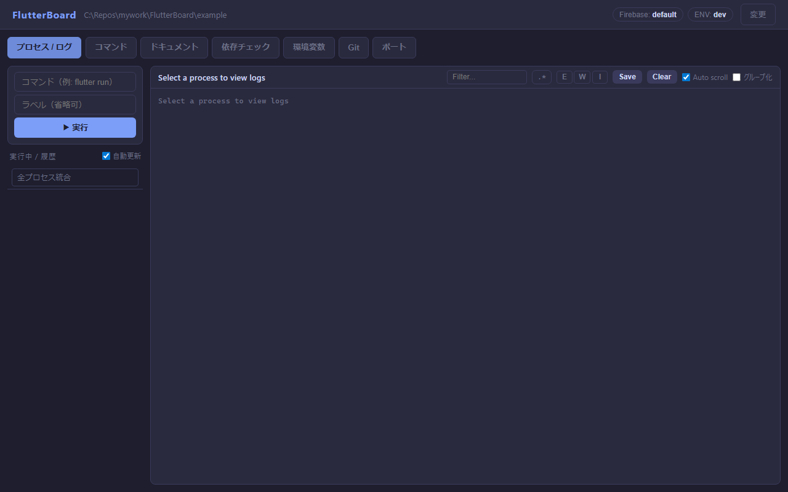
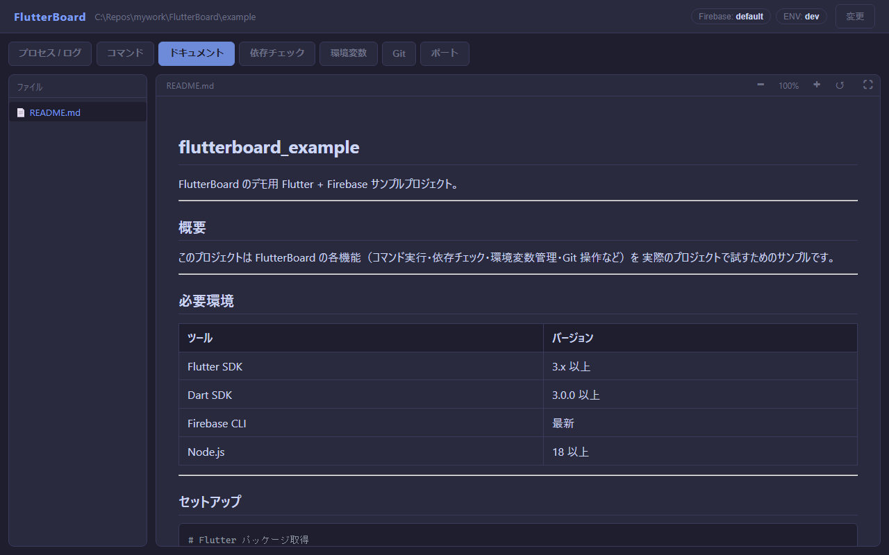
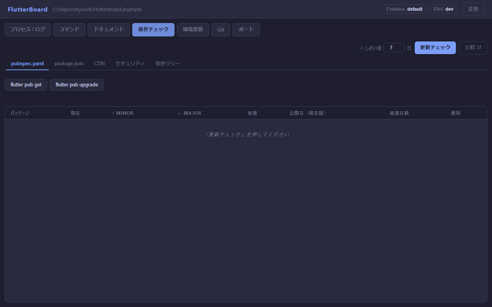
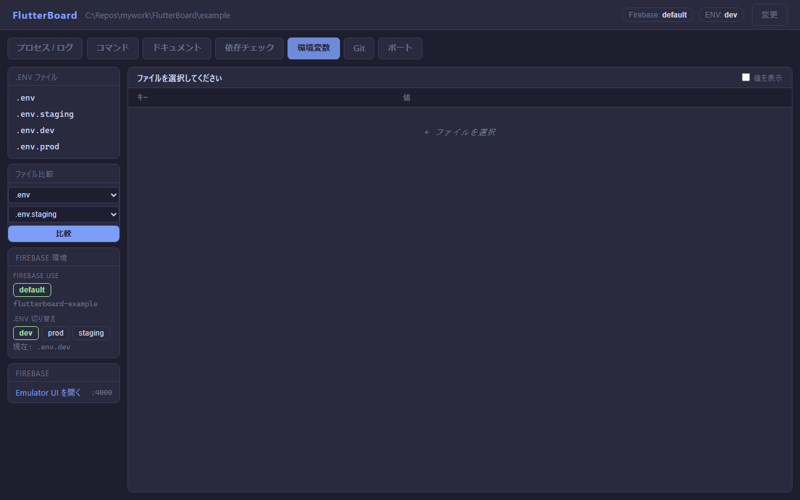
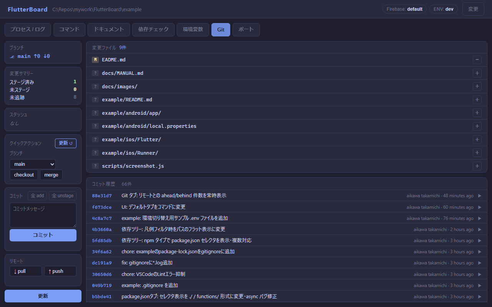
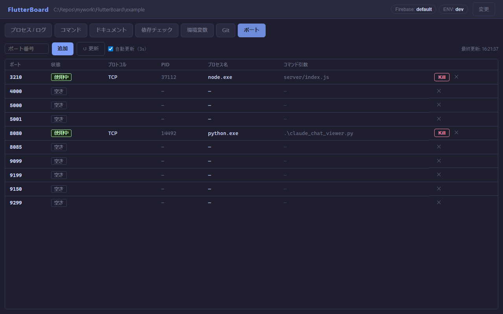

# FlutterBoard ユーザーマニュアル

Flutter / Firebase プロジェクト向けのローカル Web ダッシュボード。
`http://localhost:3210` をブラウザで開いて使用します。

---

## 起動・停止

```
start.cmd      バックグラウンドで起動（ポート 3210）
stop.cmd       PID ファイルを読んで停止
npm run dev    ファイル変更で自動再起動（開発用）
```

---

## 画面構成



ヘッダーにはプロジェクト選択・Firebase 環境・FVM バージョンが常時表示されます。  
タブ切り替えで各機能を使用します。

---

## コマンド タブ

Flutter / Firebase / npm の定番コマンドをワンクリックで実行します。


### サブタブ

- **Flutter** — pub get / analyze / doctor / build / test など
- **Firebase** — emulators:start / deploy など
- **npm** — `package.json` の scripts を自動読み込み、☆ でピン留め
- **シーケンス** — 複数コマンドを順番に実行するタスクを定義・保存
- **実行ビルダー** — デバイス / フレーバー / エントリポイント / ブランチ / スタッシュを選択してコマンドを組み立て
- **Analyze** — `flutter analyze` 結果を severity フィルタ・VSCode リンク付きで一覧表示

---

## プロセス / ログ タブ

起動中のコマンドをリアルタイムで監視・操作します。



### 主な機能

- 複数プロセスをタブ切り替えで管理
- SSE によるリアルタイムログ表示
- **PTY モード** — `r`（Hot Reload）・`R`（Hot Restart）等のキー入力をブラウザから送信
- **DevTools 連携** — `flutter run` のログから VM Service URL / DevTools URL を自動検出しヘッダーに表示
- **統合ビュー** — 全プロセスのログをタイムスタンプ順に統合表示
- **ログフィルタ** — キーワード / 正規表現、ERROR / WARN / INFO レベルバッジ

---

## ドキュメント タブ

プロジェクト内の Markdown ファイルをブラウザで閲覧します。



### 主な機能

- `README.md` をデフォルト表示
- `docs/` 以下のファイルをサイドバーに一覧表示
- コードブロックのシンタックスハイライト
- Mermaid ダイアグラムのインラインレンダリング（ズーム / パン対応）
- 全画面表示・ページズームコントロール

---

## 依存チェック タブ

pubspec.yaml / package.json / CDN ライブラリのバージョンを一括確認します。



### サブタブ

- **pubspec.yaml** — pub.dev API で最新バージョンを確認、MAJOR / minor / 最新 をバッジ表示
- **package.json** — npm registry で最新バージョンを確認、Provenance バッジ付き
- **CDN** — HTML 内の cdnjs / jsDelivr / unpkg バージョンを確認
- **npm audit** — severity 別バッジ表示、audit fix 実行
- **セキュリティ診断** — OSV.dev API で Dart パッケージの既知 CVE を照会
- **依存ツリー** — `flutter pub deps` / `npm ls` をツリー描画、逆引きハイライト、競合ノード赤表示
- **依存比較** — 別ブランチ / 別プロジェクトと pubspec・npm を横断比較

---

## 環境変数 タブ

`.env` ファイルの内容を安全に確認・比較します。



### 主な機能

- `.env` / `.env.development` / `.env.staging` / `.env.production` 等を一覧表示
- パスワード・API キー等の機密値をデフォルトでマスク
- **差分比較** — 2 ファイル間のキー差分を横並び表示、片方にしかないキーを警告表示
- Firebase Emulator UI（`:4000`）へのリンク

---

## Git タブ

ブランチ・変更ファイル・コミット履歴の確認と基本 Git 操作を行います。



### 主な機能

- ブランチ表示、リモートとの ahead / behind 件数を常時表示
- 変更ファイル一覧（staged / unstaged / untracked）
- diff インライン表示
- スタッシュ一覧
- コミット履歴（15 件、詳細パネル）
- ファイル個別 stage / unstage、全 add、コミット、pull / push
- ブランチ checkout / merge、スタッシュ pop / apply

---

## ポート タブ

指定ポートの使用状況をリアルタイムで監視します。



### 主な機能

- 使用中 / 空き状態を 3 秒ごとに自動更新
- 競合プロセスのワンクリック kill
- 監視ポートの追加 / 除外

---

## セキュリティ方針

- サーバーは `127.0.0.1`（ローカルのみ）にバインド。外部からはアクセス不可
- npm パッケージ依存を最小化（`node-pty` のみオプション）
- コマンドは直接実行せず入力欄にセット、ユーザーが確認後に実行
